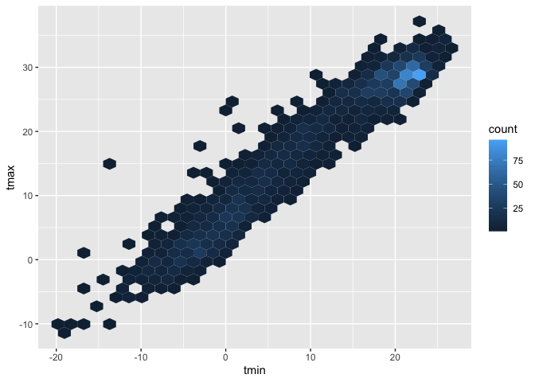
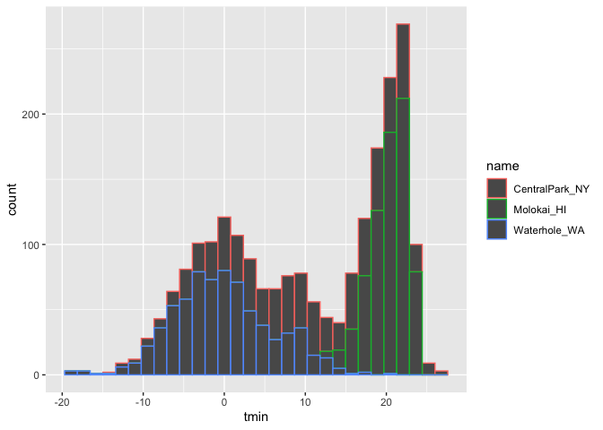

Data_viz_1
================
Kino Watanabe
2025-10-05

``` r
library(tidyverse)
```

    ## ── Attaching core tidyverse packages ──────────────────────── tidyverse 2.0.0 ──
    ## ✔ dplyr     1.1.4     ✔ readr     2.1.5
    ## ✔ forcats   1.0.0     ✔ stringr   1.5.1
    ## ✔ ggplot2   3.5.2     ✔ tibble    3.3.0
    ## ✔ lubridate 1.9.4     ✔ tidyr     1.3.1
    ## ✔ purrr     1.1.0     
    ## ── Conflicts ────────────────────────────────────────── tidyverse_conflicts() ──
    ## ✖ dplyr::filter() masks stats::filter()
    ## ✖ dplyr::lag()    masks stats::lag()
    ## ℹ Use the conflicted package (<http://conflicted.r-lib.org/>) to force all conflicts to become errors

``` r
library(ggridges)
library(p8105.datasets)
```

- `ggridges` creates ridgeline plots, which are overlapping density
  plots used to visualize the distribution of a numerical variable
  across multiple categories or over time/space

### Loading weather dataset

``` r
data("weather_df")
```

### making first plot

- ‘geom_point’ = scatterpoint

Formal way

``` r
ggplot(data = weather_df, mapping = aes(x = tmin, y = tmax)) + 
    geom_point()
```

    ## Warning: Removed 17 rows containing missing values or values outside the scale range
    ## (`geom_point()`).

<!-- --> Same
plot - without data, mapping

``` r
ggplot(weather_df, aes(x = tmin, y = tmax)) + 
    geom_point()
```

    ## Warning: Removed 17 rows containing missing values or values outside the scale range
    ## (`geom_point()`).

<!-- --> Another
way - can pipe in df

``` r
weather_df |> 
    ggplot(aes(x = tmin, y = tmax)) +
    geom_point()
```

    ## Warning: Removed 17 rows containing missing values or values outside the scale range
    ## (`geom_point()`).

<!-- --> Save plot
to environment

``` r
ggp_weather_scatterplot = 
    weather_df |> 
          ggplot(aes(x = tmin, y = tmax)) +
          geom_point()

ggp_weather_scatterplot
```

    ## Warning: Removed 17 rows containing missing values or values outside the scale range
    ## (`geom_point()`).

<!-- -->

Check how muching missingness I have for a variable! Check that some
rows are missing:

``` r
weather_df |> 
    filter(is.na(tmax))
```

    ## # A tibble: 17 × 6
    ##    name         id          date        prcp  tmax  tmin
    ##    <chr>        <chr>       <date>     <dbl> <dbl> <dbl>
    ##  1 Molokai_HI   USW00022534 2022-05-31    NA    NA    NA
    ##  2 Waterhole_WA USS0023B17S 2021-03-09    NA    NA    NA
    ##  3 Waterhole_WA USS0023B17S 2021-12-07    51    NA    NA
    ##  4 Waterhole_WA USS0023B17S 2021-12-31     0    NA    NA
    ##  5 Waterhole_WA USS0023B17S 2022-02-03     0    NA    NA
    ##  6 Waterhole_WA USS0023B17S 2022-08-09    NA    NA    NA
    ##  7 Waterhole_WA USS0023B17S 2022-08-10    NA    NA    NA
    ##  8 Waterhole_WA USS0023B17S 2022-08-11    NA    NA    NA
    ##  9 Waterhole_WA USS0023B17S 2022-08-12    NA    NA    NA
    ## 10 Waterhole_WA USS0023B17S 2022-08-13    NA    NA    NA
    ## 11 Waterhole_WA USS0023B17S 2022-08-14    NA    NA    NA
    ## 12 Waterhole_WA USS0023B17S 2022-08-15    NA    NA    NA
    ## 13 Waterhole_WA USS0023B17S 2022-08-16    NA    NA    NA
    ## 14 Waterhole_WA USS0023B17S 2022-08-17    NA    NA    NA
    ## 15 Waterhole_WA USS0023B17S 2022-08-18    NA    NA    NA
    ## 16 Waterhole_WA USS0023B17S 2022-08-19    NA    NA    NA
    ## 17 Waterhole_WA USS0023B17S 2022-12-31    76    NA    NA

### Fancier data plots

can vary aesthetics by levels of data

``` r
weather_df |> 
      ggplot(aes(x = tmin, y = tmax, color = name)) + 
      geom_point(alpha =  0.3) +
      geom_smooth(se = FALSE) 
```

    ## `geom_smooth()` using method = 'loess' and formula = 'y ~ x'

    ## Warning: Removed 17 rows containing non-finite outside the scale range
    ## (`stat_smooth()`).

    ## Warning: Removed 17 rows containing missing values or values outside the scale range
    ## (`geom_point()`).

<!-- --> \* Can
see density of points by setting opacity with `geom_point(alpha =  0.3)`
\* can overlay statistical models on top of data with
`geom_smooth(se = FALSE)`. SE around it shouldn’t be trusted so se =
false.

Where you define aesthetics can matter

``` r
weather_df |> 
      ggplot(aes(x = tmin, y = tmax)) + 
      geom_point(aes(color = name), alpha =  0.3, size = 0.6) +
      geom_smooth(se = FALSE) 
```

    ## `geom_smooth()` using method = 'gam' and formula = 'y ~ s(x, bs = "cs")'

    ## Warning: Removed 17 rows containing non-finite outside the scale range
    ## (`stat_smooth()`).

    ## Warning: Removed 17 rows containing missing values or values outside the scale range
    ## (`geom_point()`).

<!-- --> can
change size based on data values

``` r
weather_df |> 
      ggplot(aes(x = tmin, y = tmax)) + 
      geom_point(aes(color = name, size = prcp), alpha =  0.3) +
      geom_smooth(se = FALSE) 
```

    ## `geom_smooth()` using method = 'gam' and formula = 'y ~ s(x, bs = "cs")'

    ## Warning: Removed 17 rows containing non-finite outside the scale range
    ## (`stat_smooth()`).

    ## Warning: Removed 19 rows containing missing values or values outside the scale range
    ## (`geom_point()`).

<!-- --> Use
faceting real quick - break single plot into multiple plots
`facet_grid(rows ~ columns)`

``` r
weather_df |> 
      ggplot(aes(x = tmin, y = tmax)) + 
      geom_point(aes(color = name), alpha =  0.3) +
      geom_smooth(se = FALSE) +
      facet_grid(. ~ name)
```

    ## `geom_smooth()` using method = 'loess' and formula = 'y ~ x'

    ## Warning: Removed 17 rows containing non-finite outside the scale range
    ## (`stat_smooth()`).

    ## Warning: Removed 17 rows containing missing values or values outside the scale range
    ## (`geom_point()`).

<!-- -->

``` r
weather_df |> 
      ggplot(aes(x = tmin, y = tmax)) + 
      geom_point(aes(color = name), alpha =  0.3) +
      geom_smooth(se = FALSE) +
      facet_grid(name ~ .)
```

    ## `geom_smooth()` using method = 'loess' and formula = 'y ~ x'

    ## Warning: Removed 17 rows containing non-finite outside the scale range
    ## (`stat_smooth()`).
    ## Removed 17 rows containing missing values or values outside the scale range
    ## (`geom_point()`).

<!-- -->

Let’s make a more interesting scatterplot

``` r
weather_df |> 
      ggplot(aes(x = tmin, y = tmax,  color = name, shape = name)) + 
      geom_point(aes(size = prcp), alpha =  0.3) +
      geom_smooth(se = FALSE) +
      facet_grid(. ~ name)
```

    ## `geom_smooth()` using method = 'loess' and formula = 'y ~ x'

    ## Warning: Removed 17 rows containing non-finite outside the scale range
    ## (`stat_smooth()`).

    ## Warning: Removed 19 rows containing missing values or values outside the scale range
    ## (`geom_point()`).

<!-- --> \###
Learning assessment

Write a code chain that starts with weather_df; focuses only on Central
Park, converts temperatures to Fahrenheit, makes a scatterplot of min
vs. max temperature, and overlays a linear regression line (using
options in geom_smooth()).

- linear regression line –\> `geom_smooth(method = "lm", se = FALSE)`

``` r
weather_df |> 
      filter(name == "CentralPark_NY") |> 
      mutate(
        tmax_f = (tmax * 9/5) + 32,
        tmin_f = (tmin * 9/5) + 32) |> 
      ggplot(aes(x = tmin_f, y = tmax_f)) +
      geom_point(alpha =  0.3) +
      geom_smooth(method = "lm", se = FALSE)
```

    ## `geom_smooth()` using formula = 'y ~ x'

<!-- --> \###
small things

We can can take out the points

``` r
weather_df |> 
      ggplot(aes(x = tmin, y = tmax,  color = name, shape = name)) + 
      # geom_point(alpha =  0.3) +
      geom_smooth(se = FALSE)
```

    ## `geom_smooth()` using method = 'loess' and formula = 'y ~ x'

    ## Warning: Removed 17 rows containing non-finite outside the scale range
    ## (`stat_smooth()`).

<!-- --> can
reorder and have it done in a different order

``` r
weather_df |> 
      ggplot(aes(x = tmin, y = tmax,  color = name, shape = name)) + 
      geom_smooth(se = FALSE) +
      geom_point(alpha =  0.3) 
```

    ## `geom_smooth()` using method = 'loess' and formula = 'y ~ x'

    ## Warning: Removed 17 rows containing non-finite outside the scale range
    ## (`stat_smooth()`).

    ## Warning: Removed 17 rows containing missing values or values outside the scale range
    ## (`geom_point()`).

<!-- -->

`geom_hex()` can tell us the density of data, more explicit

``` r
weather_df |> 
    ggplot(aes(x = tmin, y = tmax)) +
    geom_hex()
```

    ## Warning: Removed 17 rows containing non-finite outside the scale range
    ## (`stat_binhex()`).

<!-- -->

set all points purple

``` r
weather_df |> 
      ggplot(aes(x = tmin, y = tmax)) +
      geom_point(color = "purple") 
```

    ## Warning: Removed 17 rows containing missing values or values outside the scale range
    ## (`geom_point()`).

<!-- --> \###
univariate plot

`geom_histogram(color = "bounds", fill = "inside color")`

``` r
weather_df |> 
    ggplot(aes(x = tmin)) +
    geom_histogram(color = "white", fill = "red")
```

    ## `stat_bin()` using `bins = 30`. Pick better value with `binwidth`.

    ## Warning: Removed 17 rows containing non-finite outside the scale range
    ## (`stat_bin()`).

<!-- -->

Overlaying data in historgram – not great

``` r
weather_df |> 
    ggplot(aes(x = tmin, color = name)) +
    geom_histogram()
```

    ## `stat_bin()` using `bins = 30`. Pick better value with `binwidth`.

    ## Warning: Removed 17 rows containing non-finite outside the scale range
    ## (`stat_bin()`).

<!-- -->

``` r
weather_df |> 
    ggplot(aes(x = tmin, fill = name)) +
    geom_histogram()
```

    ## `stat_bin()` using `bins = 30`. Pick better value with `binwidth`.

    ## Warning: Removed 17 rows containing non-finite outside the scale range
    ## (`stat_bin()`).

<!-- -->

How can I fix this? maybe facet?

``` r
weather_df |> 
    ggplot(aes(x = tmin, color = name)) +
    geom_histogram() +
    facet_grid(name ~ .)
```

    ## `stat_bin()` using `bins = 30`. Pick better value with `binwidth`.

    ## Warning: Removed 17 rows containing non-finite outside the scale range
    ## (`stat_bin()`).

<!-- -->

maybe a density plot?

``` r
weather_df |> 
    ggplot(aes(x = tmin, fill = name)) +
    geom_density(alpha = 0.2) 
```

    ## Warning: Removed 17 rows containing non-finite outside the scale range
    ## (`stat_density()`).

<!-- -->

boxplot

``` r
weather_df |> 
    ggplot(aes(x = name, y = tmin)) +
    geom_boxplot(aes(fill = name )) 
```

    ## Warning: Removed 17 rows containing non-finite outside the scale range
    ## (`stat_boxplot()`).

<!-- --> violin
plot

``` r
weather_df |> 
    ggplot(aes(x = name, y = tmin, fill = name)) +
    geom_violin() 
```

    ## Warning: Removed 17 rows containing non-finite outside the scale range
    ## (`stat_ydensity()`).

<!-- -->

ridge plot

``` r
weather_df |> 
    ggplot(aes(x = tmin,y = name, fill = name)) +
    geom_density_ridges() 
```

    ## Picking joint bandwidth of 1.41

    ## Warning: Removed 17 rows containing non-finite outside the scale range
    ## (`stat_density_ridges()`).

<!-- -->

- map an aesthetic within aes – I want this to vary by some value in the
  data.
- set aes outside aes – setting for entire figure

### Learning Assessment

Learning Assessment: Make plots that compare precipitation across
locations. Try a histogram, a density plot, a boxplot, a violin plot,
and a ridgeplot; use aesthetic mappings to make your figure readable.

``` r
weather_df |> 
    ggplot(aes(x = prcp, fill = name)) +
    geom_histogram() +
    facet_grid(name ~ .)
```

    ## `stat_bin()` using `bins = 30`. Pick better value with `binwidth`.

    ## Warning: Removed 15 rows containing non-finite outside the scale range
    ## (`stat_bin()`).

<!-- -->

``` r
weather_df |> 
    ggplot(aes(x = prcp, color = name)) +
    geom_density(alpha = 0.5)
```

    ## Warning: Removed 15 rows containing non-finite outside the scale range
    ## (`stat_density()`).

<!-- --> what if
we filtered data to zoom in

``` r
weather_df |> 
    filter(prcp>5, prcp<1000) |> 
    ggplot(aes(x = prcp, fill = name)) +
    geom_density(alpha = 0.2)
```

<!-- -->

``` r
weather_df |> 
    ggplot(aes(x = name, y = prcp, fill = name)) +
    geom_boxplot()
```

    ## Warning: Removed 15 rows containing non-finite outside the scale range
    ## (`stat_boxplot()`).

<!-- -->

``` r
weather_df |> 
    ggplot(aes(x = prcp, y = name, fill = name)) +
    geom_violin()
```

    ## Warning: Removed 15 rows containing non-finite outside the scale range
    ## (`stat_ydensity()`).

<!-- -->

``` r
weather_df |> 
    ggplot(aes(x = prcp, y = name, fill = name)) +
    geom_density_ridges(alpha = 0.2)
```

    ## Picking joint bandwidth of 9.22

    ## Warning: Removed 15 rows containing non-finite outside the scale range
    ## (`stat_density_ridges()`).

<!-- --> \###
saving and embedding plots

saving plots

``` r
ggp_weather_violin = 
    weather_df |> 
    ggplot(aes(x = prcp, y = name, fill = name)) +
    geom_violin()

ggsave("plots/violin_plot.pdf", ggp_weather_violin,
    width = 8, height = 6)
```

    ## Warning: Removed 15 rows containing non-finite outside the scale range
    ## (`stat_ydensity()`).

embedding plots

``` r
ggplot(weather_df, aes(x = tmin, y = tmax)) + 
  geom_point(aes(color = name))
```

    ## Warning: Removed 17 rows containing missing values or values outside the scale range
    ## (`geom_point()`).

<!-- -->

``` r
knitr::opts_chunk$set(
  fig.width = 6,
  fig.asp = .6,
  out.width = "90%"
)
```
