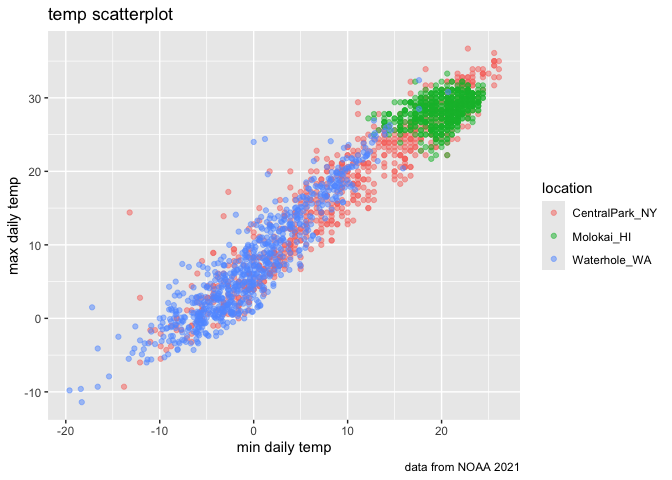
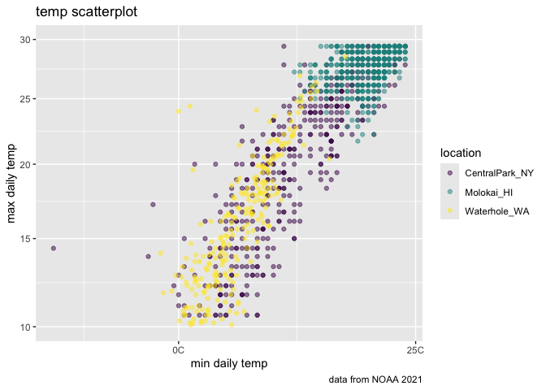
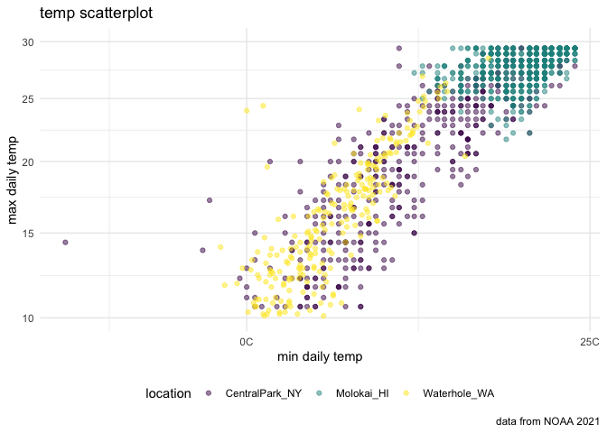
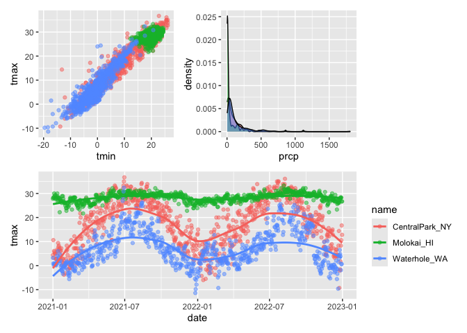
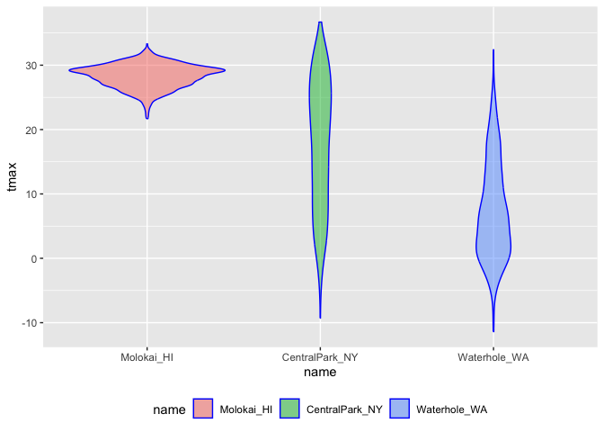
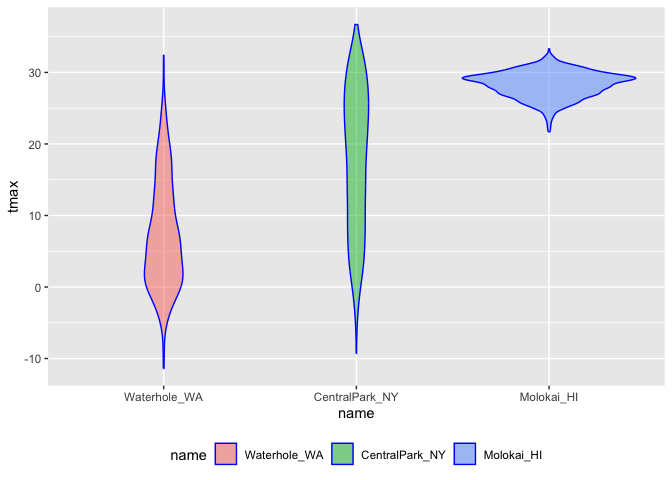
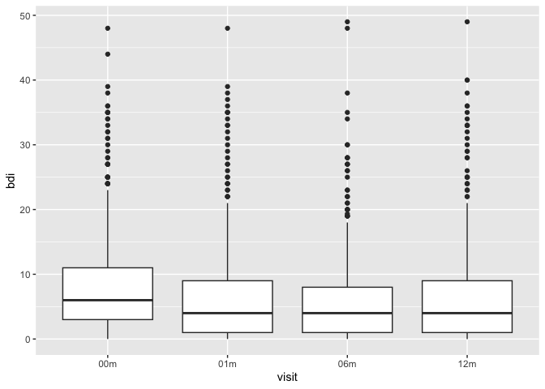
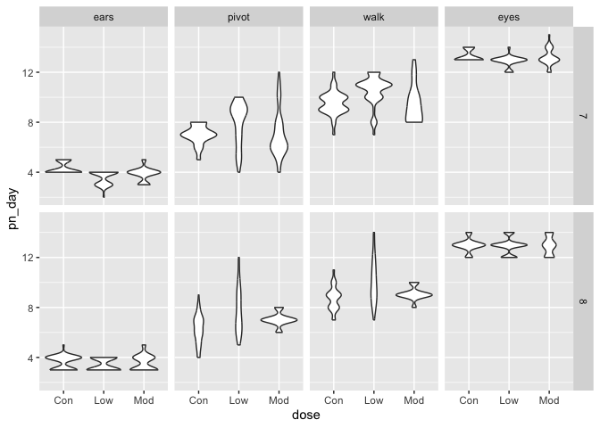

Viz_2
================
Kino Watanabe
2025-10-06

``` r
library(tidyverse)
```

    ## ── Attaching core tidyverse packages ──────────────────────── tidyverse 2.0.0 ──
    ## ✔ dplyr     1.1.4     ✔ readr     2.1.5
    ## ✔ forcats   1.0.0     ✔ stringr   1.5.1
    ## ✔ ggplot2   3.5.2     ✔ tibble    3.3.0
    ## ✔ lubridate 1.9.4     ✔ tidyr     1.3.1
    ## ✔ purrr     1.1.0     
    ## ── Conflicts ────────────────────────────────────────── tidyverse_conflicts() ──
    ## ✖ dplyr::filter() masks stats::filter()
    ## ✖ dplyr::lag()    masks stats::lag()
    ## ℹ Use the conflicted package (<http://conflicted.r-lib.org/>) to force all conflicts to become errors

``` r
library(ggridges)
library(p8105.datasets)
library(patchwork)
```

- `ggridges` creates ridgeline plots, which are overlapping density
  plots used to visualize the distribution of a numerical variable
  across multiple categories or over time/space

### Loading weather dataset

``` r
data("weather_df")
```

### making basic scatterpoint

``` r
weather_df |> 
    ggplot(aes(x = tmin, y = tmax)) +
    geom_point(aes(color = name), alpha = 0.5) +
    labs(
        x = "min daily temp",
        y = "max daily temp",
        title = "temp scatterplot",
        caption = "data from NOAA 2021",
        color = "location"
    )
```

    ## Warning: Removed 17 rows containing missing values or values outside the scale range
    ## (`geom_point()`).

<!-- --> \### scales \*
Mapping from data values to aesthetics (color, size, shape, axes) \*
`filter(tmax > 10, tmax <30)` and
`scale_y_continuous(...limits = c(10,30)` do the same thing

``` r
weather_df |> 
    filter(tmax > 10, tmax <30) |> 
    ggplot(aes(x = tmin, y = tmax)) +
    geom_point(aes(color = name), alpha = 0.5) +
    labs(
        x = "min daily temp",
        y = "max daily temp",
        title = "temp scatterplot",
        caption = "data from NOAA 2021",
        color = "location"
    ) +
    scale_x_continuous(
        breaks = c(-20, 0, 25),
        labels = c("20C","0C", "25C")
    ) +
    scale_y_continuous(
        trans = "sqrt",
        limits = c(10,30)
    ) +
  viridis::scale_color_viridis(
    discrete = TRUE
  )
```

<!-- -->

### themes

    * Appearance of the plot (background, grid, text, legend)

Make my base plot – code is getting long so save as output

``` r
ggplot_temp = 
weather_df |> 
    filter(tmax > 10, tmax <30) |> 
    ggplot(aes(x = tmin, y = tmax)) +
    geom_point(aes(color = name), alpha = 0.5) +
    labs(
        x = "min daily temp",
        y = "max daily temp",
        title = "temp scatterplot",
        caption = "data from NOAA 2021",
        color = "location"
    ) +
    scale_x_continuous(
        breaks = c(-20, 0, 25),
        labels = c("20C","0C", "25C")
    ) +
    scale_y_continuous(
        trans = "sqrt",
        limits = c(10,30)
    ) +
  viridis::scale_color_viridis(
    discrete = TRUE
  )
```

update my base plot \* also `theme_bw()` `theme_minimal` `theme_dark`

``` r
ggplot_temp + 
      theme_minimal () +
    theme(legend.position = "bottom") 
```

<!-- -->

### adding data in geoms

``` r
central_park =
    weather_df |> 
    filter(name == "CentralPark_NY")
    
molokai_df = 
      weather_df |> 
      filter(name == "Molokai_HI")

ggplot(data = molokai_df, aes(x = date, y = tmax, color =  name)) +
  geom_point() +
  geom_line(data = central_park)
```

    ## Warning: Removed 1 row containing missing values or values outside the scale range
    ## (`geom_point()`).

<!-- -->

### patchwork

Make 3 plots and combine using patchwork.

``` r
ggp_tmax_tmin = 
    weather_df |> 
    ggplot(aes(x = tmin, y = tmax, color = name)) +
    geom_point(alpha = 0.5) + theme(legend.position = "none")


 ggp_prcp_density = 
    weather_df |> 
    filter(prcp > 0) |> 
    ggplot(aes(x = prcp, fill = name)) +
    geom_density(alpha = 0.5) +  theme(legend.position = "none")
 

 ggp_temp_season = 
    weather_df |> 
    ggplot(aes(x = date, y = tmax, color = name)) +
    geom_point(alpha = 0.5) + 
    geom_smooth(se = FALSE)
 
(ggp_tmax_tmin + ggp_prcp_density) / ggp_temp_season
```

    ## Warning: Removed 17 rows containing missing values or values outside the scale range
    ## (`geom_point()`).

    ## `geom_smooth()` using method = 'loess' and formula = 'y ~ x'

    ## Warning: Removed 17 rows containing non-finite outside the scale range
    ## (`stat_smooth()`).
    ## Removed 17 rows containing missing values or values outside the scale range
    ## (`geom_point()`).

<!-- -->

### Data Manipulation

Let’s make temp violin plots

`fct_relevel` tell me which one goes in what order \* The name “forcats”
actually comes from “for categorical variables” → “for-cats.” 🐱

``` r
weather_df |>
  mutate(name = forcats::fct_relevel(name, c("Molokai_HI", "CentralPark_NY", "Waterhole_WA"))) |> 
  ggplot(aes(x = name, y = tmax)) + 
  geom_violin(aes(fill = name), color = "blue", alpha = .5) + 
  theme(legend.position = "bottom")
```

    ## Warning: Removed 17 rows containing non-finite outside the scale range
    ## (`stat_ydensity()`).

<!-- -->

`fct_reorder` reorders automatically by descending tmax

``` r
weather_df |>
  mutate(name = fct_reorder(name,tmax)) |> 
  ggplot(aes(x = name, y = tmax)) + 
  geom_violin(aes(fill = name), color = "blue", alpha = .5) + 
  theme(legend.position = "bottom")
```

    ## Warning: There was 1 warning in `mutate()`.
    ## ℹ In argument: `name = fct_reorder(name, tmax)`.
    ## Caused by warning:
    ## ! `fct_reorder()` removing 17 missing values.
    ## ℹ Use `.na_rm = TRUE` to silence this message.
    ## ℹ Use `.na_rm = FALSE` to preserve NAs.

    ## Warning: Removed 17 rows containing non-finite outside the scale range
    ## (`stat_ydensity()`).

<!-- -->

what about data tidiness??

`fct_inorder`

``` r
pulse_data = 
  haven::read_sas("data/public_pulse_data.sas7bdat") |>
  janitor::clean_names() |>
  pivot_longer(
    bdi_score_bl:bdi_score_12m,
    names_to = "visit", 
    names_prefix = "bdi_score_",
    values_to = "bdi") |>
  select(id, visit, everything()) |>
  mutate(
    visit = recode(visit, "bl" = "00m"),
    visit = fct_inorder(visit)) |>
  arrange(id, visit)

ggplot(pulse_data, aes(x = visit, y = bdi)) + 
  geom_boxplot()
```

    ## Warning: Removed 879 rows containing non-finite outside the scale range
    ## (`stat_boxplot()`).

<!-- -->

``` r
pup_data = 
  read_csv("./data/FAS_pups.csv", na = c("NA", ".", ""), skip = 3) |>
  janitor::clean_names() |>
  mutate(
    sex = 
      case_match(
        sex, 
        1 ~ "male", 
        2 ~ "female"))
```

    ## Rows: 313 Columns: 6
    ## ── Column specification ────────────────────────────────────────────────────────
    ## Delimiter: ","
    ## chr (1): Litter Number
    ## dbl (5): Sex, PD ears, PD eyes, PD pivot, PD walk
    ## 
    ## ℹ Use `spec()` to retrieve the full column specification for this data.
    ## ℹ Specify the column types or set `show_col_types = FALSE` to quiet this message.

``` r
litter_data = 
  read_csv("./data/FAS_litters.csv", na = c("NA", ".", "")) |>
  janitor::clean_names() |>
  separate(group, into = c("dose", "day_of_tx"), sep = 3)
```

    ## Rows: 49 Columns: 8
    ## ── Column specification ────────────────────────────────────────────────────────
    ## Delimiter: ","
    ## chr (2): Group, Litter Number
    ## dbl (6): GD0 weight, GD18 weight, GD of Birth, Pups born alive, Pups dead @ ...
    ## 
    ## ℹ Use `spec()` to retrieve the full column specification for this data.
    ## ℹ Specify the column types or set `show_col_types = FALSE` to quiet this message.

``` r
fas_data = left_join(pup_data, litter_data, by = "litter_number") 

fas_data |> 
  select(sex, dose, day_of_tx, pd_ears:pd_walk) |> 
  pivot_longer(
    pd_ears:pd_walk,
    names_to = "outcome", 
    names_prefix = "pd_",
    values_to = "pn_day") |> 
  drop_na() |> 
  mutate(outcome = forcats::fct_reorder(outcome, pn_day, median)) |> 
  
  ggplot(aes(x = dose, y = pn_day)) + 
  geom_violin() + 
  facet_grid(day_of_tx ~ outcome)
```

<!-- -->
